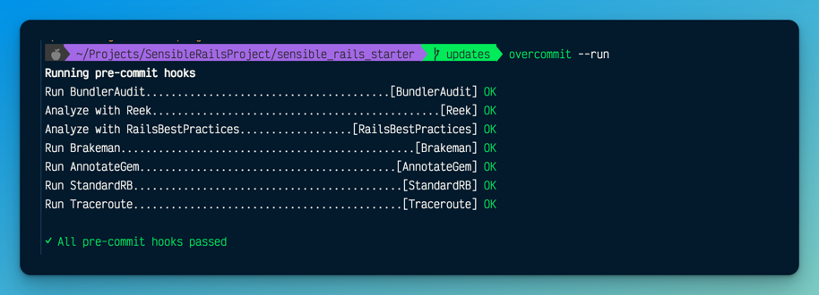

<meta name="viewport" content="width=device-width, initial-scale=1">
<link rel="stylesheet" href="github-markdown.css">
<link rel="stylesheet" href="https://cdn.simplecss.org/simple.min.css">
<style>
	.markdown-body {
		box-sizing: border-box;
		min-width: 200px;
		max-width: 980px;
		margin: 0 auto;
		padding: 45px;
	}

	@media (max-width: 767px) {
		.markdown-body {
			padding: 15px;
		}
	}
</style>
<article class="markdown-body">
	<h1>Unicorns</h1>
	<p>All the things</p>
</article>


<details open="">
  <summary></summary>

<div align="center" dir="auto" style="font-weight: lighter">
  <h1><i>S</i>ensible<i>R</i>ails</h1>

  <a target="_blank" rel="noopener noreferrer" href="https://github.com/davidteren/sensible_rails_starter"></a>

  <h3>🚀 Focus on building stuff and not setup. 🚀</h3>
<hr>
</div>
</details>
   


> 


>
>  [](https://ruby.ci/)
>
> _We highly recommend [RubyCI](https://ruby.ci/) for builds_

--- 

## Getting Started

- Click the [**_Use this template_**](https://github.com/davidteren/sensible_rails_starter/generate) button to create a
  clone of this repo in your Github account.
- Once you've git cloned your repo to your computer, run the following;

```bash
cd <app_name>
./bin/respawn
```

Then run the following to start the application.

```bash
./bin/dev
```

 ---

### Using overcommit

[overcommit](https://github.com/sds/overcommit) a fully configurable and extendable Git hook manager is included.
When enabled the hooks will run each time a git commit is made. If any of the checks fail the commit will be ignored and
the erros will be shown.

Enable overcommit

```bash
 overcommit --sign && overcommit --sign pre-commit
````

Run overcommit

```bash
 overcommit --run
````

You should see the following


The above pre commit hooks have been defined in [.overcommit.yml](.overcommit.yml)

---

## What's in the box

> _"Good frameworks are extracted, not invented"_ - David Heinemeier Hansson

### Read the Gemfiles

The Gemfile is annotated with the description and links to each Gem's homepage for further details.

## Alternatives

[See a list of alternative Rails 7 templates here](docs/sensibles/alternatives.md)

## Contributions

Contributions welcome 🤗


> Any contribution that aligns with the vision of the SensibleRails Starter Template is welcome.
>
> **Note** that some implementations will remain trunk-based, so users have the option of including them or not.

---


<details open="">
  <summary><h2><strong>fs</strong></h2></summary>
<hr>
<p align="center" dir="auto">
  <a target="_blank" rel="noopener noreferrer" href="https://camo.githubusercontent.com/5fc84f8a06df1b2c920658674683bf48f734b5dd983737a5d1956b146611eadf/68747470733a2f2f6769746875622d726561646d652d73746174732e76657263656c2e6170702f6170693f757365726e616d653d4c6567656e646172792d506572736f6e26636f756e745f707269766174653d7472756526696e636c7564655f616c6c5f636f6d6d6974733d74727565267468656d653d7368616465732d6f662d707572706c6526686964655f626f726465723d66616c7365"></a>
</p>
<hr>
</details>